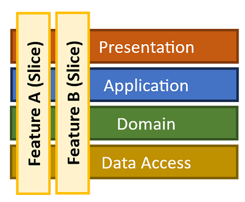

# Vertical Slice Architecture

Vertical Slice Architecture is a way to design applications by **features instead of layers**.  
Each feature (_slice_) contains everything it needs: request, handler, endpoint, and tests.

The result: a **feature-centric**, **highly cohesive**, and **low-coupled** system that is easier to navigate, scale, and refactor.

## Philosophy

- ✅ Organize by **feature (slice)**, not by technical type (controllers, services, repositories).
- ✅ Each slice owns its **request, response, handler, and endpoint**.
- ✅ Features are **independent** — they don’t bleed into each other.
- ⚠️ Common infrastructure should be minimal and stable (e.g., persistence, logging, DI).

## Slices: Commands & Queries

- **Commands** → Write operations (mutate state).
- **Queries** → Read operations (return data).
- Each slice has:
  - Request model (command/query)
  - Handler (business logic)
  - Endpoint (API mapping)
  - Optional: DTOs, validators, tests

Slices are **end-to-end verticals** — you can delete or refactor one without touching others.

## Layers

### Feature Slices

- **Self-contained** per use case.
- Lives under `Features/FeatureName/UseCaseName/`.
- Owns everything needed to implement the request.
- Example:
  - Command/Query → `CreateOrderCommand.cs`
  - Handler → `CreateOrderHandler.cs`
  - Endpoint → `CreateOrderEndpoint.cs`
  - DTO → `OrderResponse.cs`
  - Tests → `CreateOrderTests.cs`

### Domain

- Contains **entities, aggregates, and core logic**.
- Pure C# — no dependencies on frameworks or infrastructure.
- Example:
  - Entities: `Order`, `Customer`, `Product`
  - Value Objects: `Money`, `Email`

### Infrastructure

- Provides **cross-cutting services**: persistence, external APIs, messaging.
- Should be referenced **inside handlers**, not directly in endpoints.
- Examples:
  - `AppDbContext` (EF Core)
  - `EmailService`
  - `Logging`

### Composition

- Wires up DI in `Program.cs`.
- Registers MediatR, EF Core, logging, and endpoints.
- Each slice exposes an extension method to map itself.

## Example Folder Structure

```text
YourApi/
├─ YourApi.sln
├─ docs/
│  └─ architecture.md
└─ src/
   ├─ YourApi/                       # Web API project
   │  ├─ Program.cs                  # Composition root
   │  ├─ Features/
   │  │   ├─ Orders/
   │  │   │   ├─ CreateOrder/
   │  │   │   │   ├─ CreateOrderCommand.cs
   │  │   │   │   ├─ CreateOrderHandler.cs
   │  │   │   │   ├─ CreateOrderEndpoint.cs
   │  │   │   │   └─ OrderResponse.cs
   │  │   │   ├─ GetOrder/
   │  │   │   │   ├─ GetOrderQuery.cs
   │  │   │   │   ├─ GetOrderHandler.cs
   │  │   │   │   └─ GetOrderEndpoint.cs
   │  │   └─ Customers/
   │  │       ├─ UpdateCustomer/
   │  │       │   ├─ UpdateCustomerCommand.cs
   │  │       │   ├─ UpdateCustomerHandler.cs
   │  │       │   └─ UpdateCustomerEndpoint.cs
   │  │
   │  ├─ Domain/
   │  │   ├─ Orders/
   │  │   │   └─ Order.cs
   │  │   ├─ Customers/
   │  │   │   └─ Customer.cs
   │  │   └─ Shared/
   │  │       └─ ValueObjects/
   │  │           └─ Money.cs
   │  │
   │  ├─ Infrastructure/
   │  │   ├─ Persistence/
   │  │   │   └─ AppDbContext.cs
   │  │   └─ Services/
   │  │       └─ EmailService.cs
   │  │
   │  └─ YourApi.csproj
   │
└─ tests/
   ├─ YourApi.Tests/
   │  ├─ Features/
   │  │   └─ Orders/
   │  │       └─ CreateOrderTests.cs
   │  └─ YourApi.Tests.csproj
```

## Example Slice – Create Order

```csharp
// Features/Orders/CreateOrder/CreateOrderCommand.cs
public record CreateOrderCommand(int CustomerId, List<int> ProductIds) : IRequest<OrderResponse>;

// Features/Orders/CreateOrder/CreateOrderHandler.cs
public class CreateOrderHandler : IRequestHandler<CreateOrderCommand, OrderResponse>
{
    private readonly AppDbContext _db;
    public CreateOrderHandler(AppDbContext db) => _db = db;

    public async Task<OrderResponse> Handle(CreateOrderCommand request, CancellationToken ct)
    {
        var order = new Order(request.CustomerId, request.ProductIds);
        _db.Orders.Add(order);
        await _db.SaveChangesAsync(ct);
        return new OrderResponse(order.Id, order.CustomerId, order.Total);
    }
}

// Features/Orders/CreateOrder/CreateOrderEndpoint.cs
public static class CreateOrderEndpoint
{
    public static void MapCreateOrder(this IEndpointRouteBuilder app)
    {
        app.MapPost("/orders", async (CreateOrderCommand cmd, IMediator mediator) =>
            Results.Ok(await mediator.Send(cmd)));
    }
}

// Features/Orders/CreateOrder/OrderResponse.cs
public record OrderResponse(int OrderId, int CustomerId, decimal Total);
```

## Summary

- ✅ Organize by **feature slice**, not by horizontal layers.
- ✅ Each slice owns its **request, handler, endpoint, and tests**.
- ✅ Domain is pure, Infrastructure is stable, Composition wires everything.
- ⚠️ Keep cross-cutting concerns (logging, persistence, DI) separate.

Vertical Slices = **feature-focused architecture** that scales cleanly and supports rapid iteration.

## Graphic


